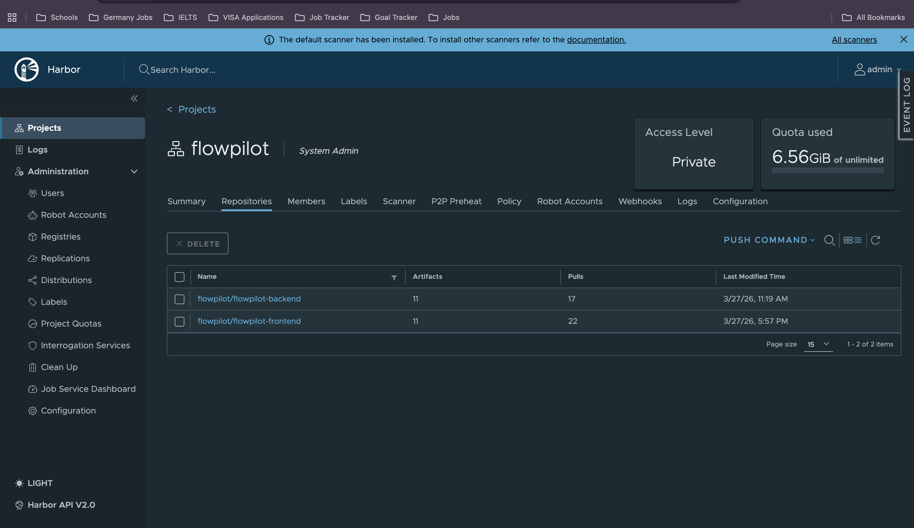
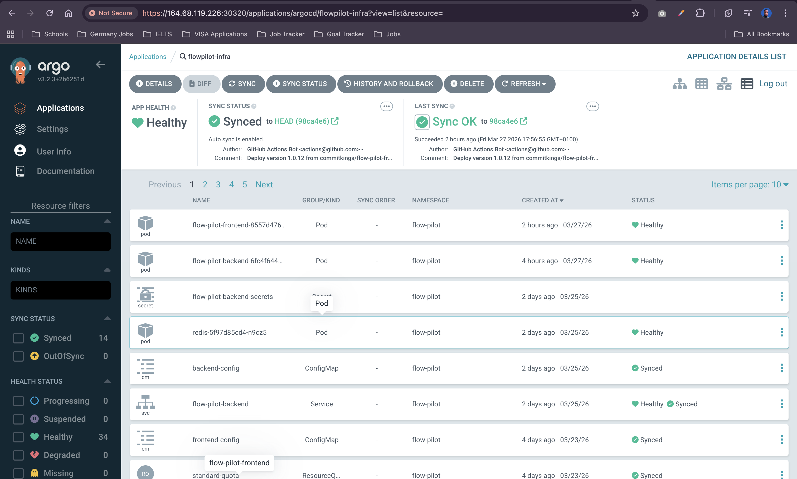

#  FlowPilot - Infrastructure

[](https://kubernetes.io/)
[](https://argoproj.github.io/cd/)
[](https://goharbor.io/)
[](https://redis.io/)
[](https://external-secrets.io/)

This repository contains the **Production-Ready Kubernetes Infrastructure** for **FlowPilot**—a high-performance, AI-driven fintech orchestration platform built for interswitch hackathon.

##  Overview

FlowPilot Infrastructure is designed with a **security-first, scalable, and cloud-native** approach. It manages everything from service deployments and micro-segmentation networking to automated secrets management with Infisical.

### Key Components:
- **GitOps with Argo CD:** Fully automated deployments using pull-based synchronization.

- **Frontend:** Next.js application served via NodePort (Optimized for performance).
- **Backend:** FastAPI/Python application integrated with Groq LLMs and Interswitch.
- **Cache Layer:** Scalable Redis deployment for session management and task queuing.
- **Secrets Management:** Automated synchronization using `ExternalSecrets` and `SecretStore`.
- **Registry:** Fully private images stored in a secure Harbour registry.
- **Security:** Granular `NetworkPolicies` for backend/frontend isolation.

---

##  Tech Stack

| Component | Technology |
| :--- | :--- |
| **Orchestration** | Kubernetes (k8s) |
| **GitOps / CD** | Argo CD |
| **Container Registry** | Harbour |
| **Secrets Engine** | Infisical / External Secrets Operator |
| **Database/Cache** | Redis |
| **Integrations** | Interswitch, Groq (LLAMA 3.3), Google OAuth |
| **Networking** | NodePort, Kubernetes Services |
| **Security** | K8s NetworkPolicies, ResourceQuotas |

###  Secure Artifact Storage
To maintain a high security posture, all container images for **FlowPilot** (Frontend & Backend) are hosted in a **Private Harbour Registry**. This ensures that our software supply chain is protected and images are only pulled from a trusted source.



---

##  Project Structure

```bash
flowpilot/
├── configmap/          # Environment-specific configuration
│   ├── backend-config.yaml
│   └── frontend-config.yaml
├── deployment/         # Application workload definitions
│   ├── backend.yaml
│   └── frontend.yaml
├── network-policy/    # Pod-to-pod communication rules
│   ├── backend-policy.yaml
│   └── frontend-policy.yaml
├── secrets/           # External secrets integration
│   ├── externalsecret.yaml
│   └── secretstore.yaml
├── services/          # Internal and external service discovery
│   ├── backend.yaml
│   └── frontend.yaml
├── redis/             # Cache infrastructure
│   └── redis.yaml
├── namespace/         # Logical isolation
│   └── flow-pilot-namespace.yaml
└── resource-quota/    # Resource governance
    └── standard-quota.yaml
```

---

##  Getting Started

### Prerequisites
- A Kubernetes Cluster (v1.24+)
- Argo CD installed on the cluster
- `kubectl` configured to your cluster

### Deployment via Argo CD

1. **Create the Project & Application:**
   Point your Argo CD application to this repository's `flowpilot/` directory.

2. **Sync Settings:**
   - **Namespace:** `flow-pilot`
   - **Automated Sync:** Enabled (Recommended)
   - **Prune Resources:** Enabled

###  Live Cluster Synchronization
Below is the live status of the **FlowPilot** infrastructure within Argo CD. This dashboard provides a real-time view of our automated GitOps workflow, ensuring the cluster state perfectly matches this repository.



---

##  Security & Performance

- **Zero-Trust Networking:** Using `NetworkPolicies`, we restrict traffic to only what's necessary (e.g., Frontend can only talk to Backend on specific ports).
- **Resource Limits:** `ResourceQuota` ensures no single service can monopolize cluster resources, maintaining high availability.
- **Secrets Encryption:** No secrets are stored in Git. All sensitive data (Interswitch keys, API tokens) are fetched dynamically from a secure vault at runtime.

---

##  Hackathon Notes
FlowPilot is built to solve 2nd-gen fintech orchestration challenges using AI. The infrastructure is designed to be **Production-Grade**, allowing us to move from prototype to scale in minutes with a robust **GitOps workflow**.

---
Created with ❤️ by the FlowPilot Team.